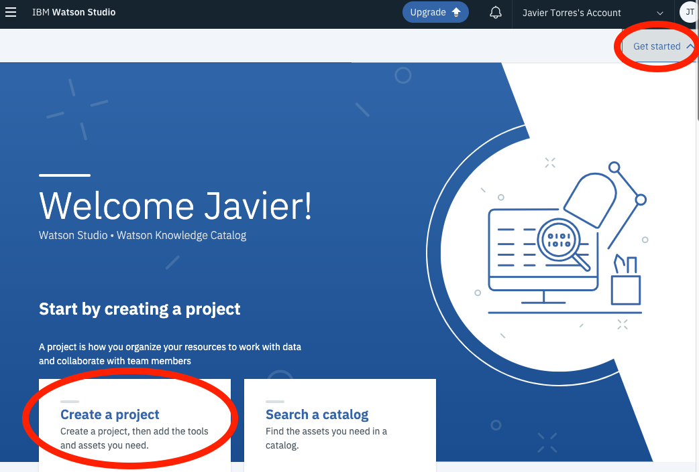
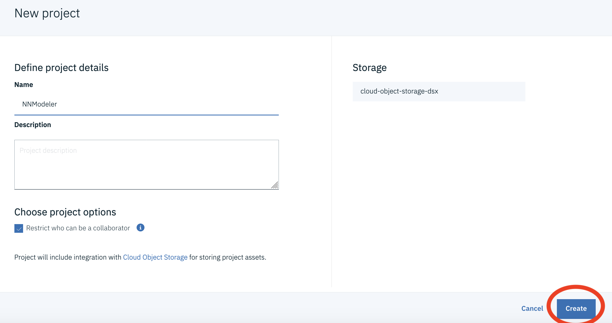
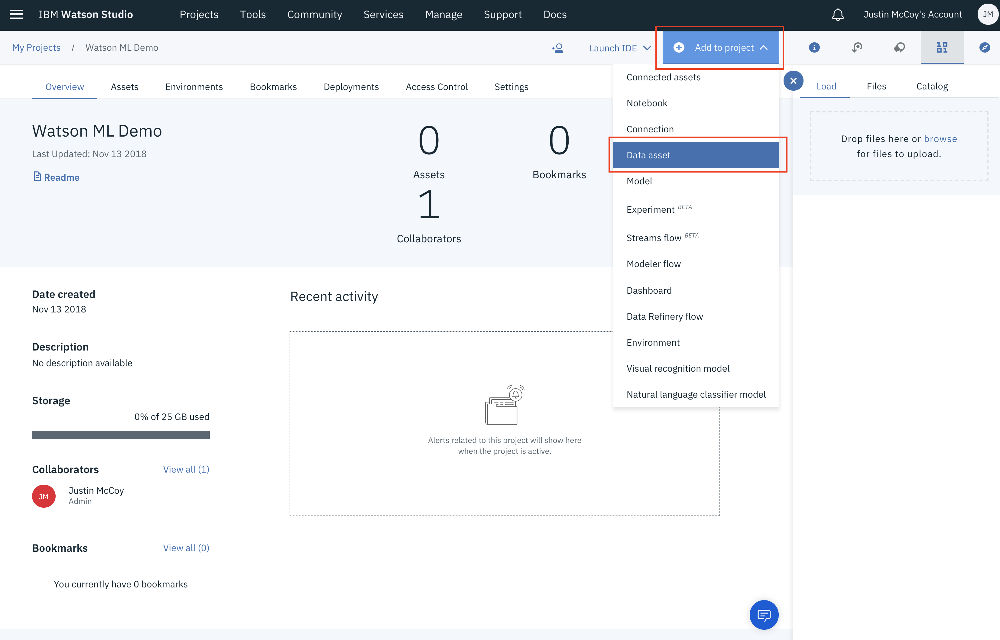
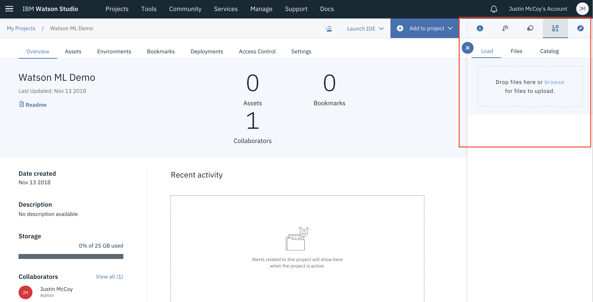
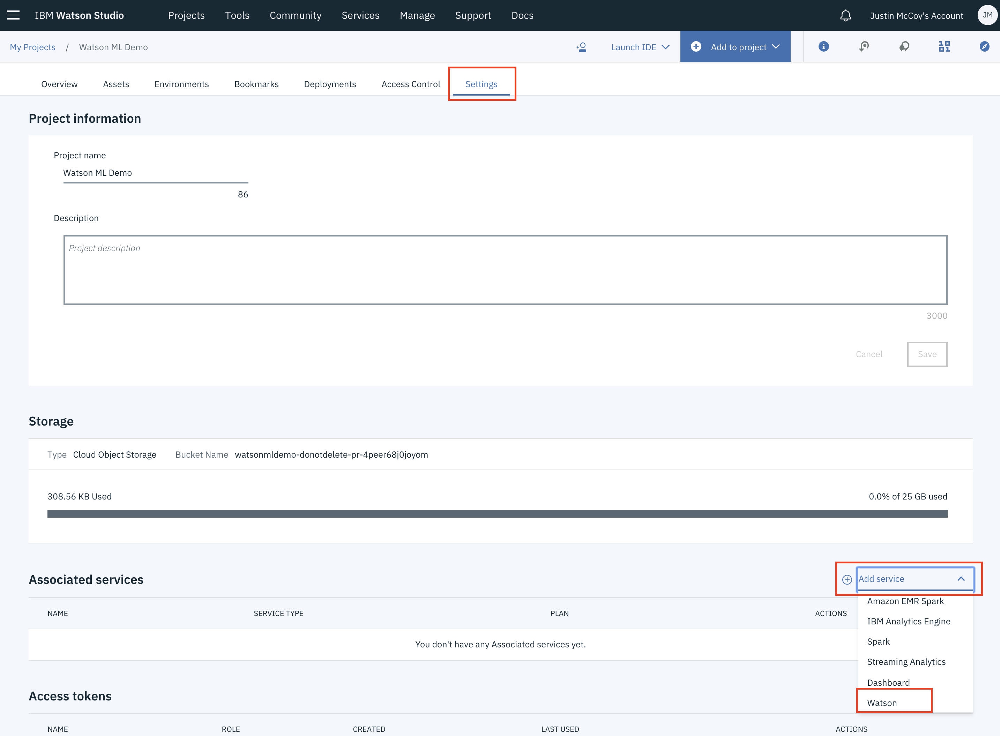
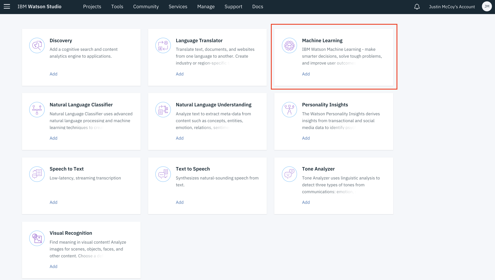
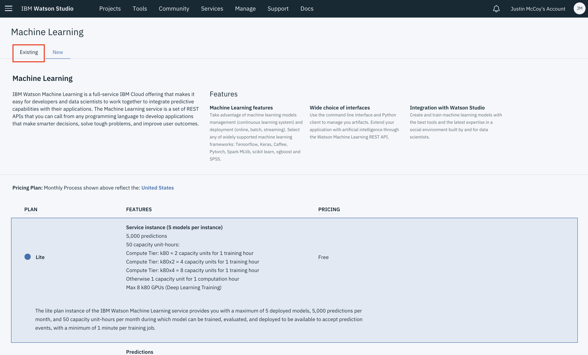
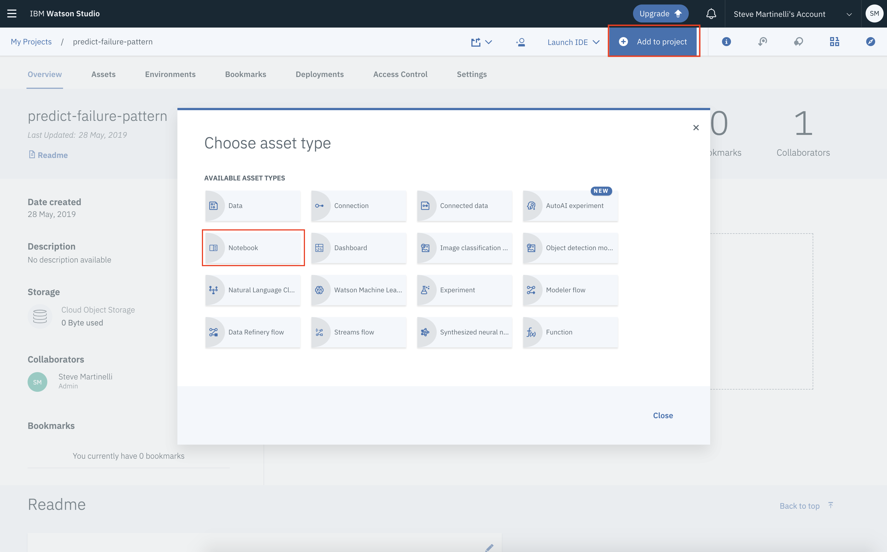
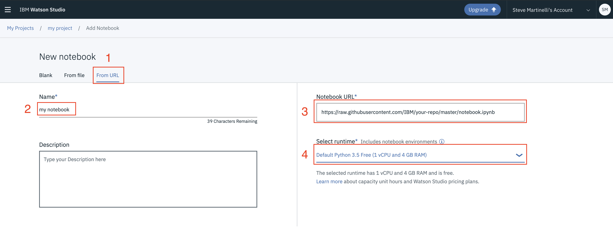
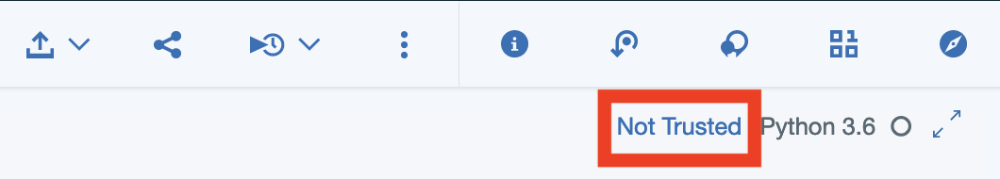

# Predicting Bank Client's Certificate of Deposit Purchase using Scikit Learn and XGBoost for imbalance dataset

This Code Pattern will guide you through how to use `XGBoost`, `Scikit Learn` and `Python` in IBM Watson Studio. The goal is to use a Jupyter notebook and data from the [UCI repository for Bank Marketing Data](https://archive.ics.uci.edu/ml/datasets/Bank+Marketing) to predict if a client will purchase a Certificate of Deposit (CD) from a banking institution.

Class imbalance is a common problem in data science, where the number of positive samples are significantly less than the number of negative samples. As data scientists, one would like to solve this problem and create a classifier with good performance. XGBoost (Extreme Gradient Boosting Decision Tree) is very common tool for creating the Machine Learning Models for classification and regression. However, there are various tricks and techniques for creating good classification models using XGBoost for imbalanced data-sets that is non-trivial and the reason for developing this Code Pattern.

In this Code Pattern, we will illustrate how the Machine Learning classification is performed using XGBoost, which is usually a better choice compared to logistic regression and other techniques. We will use a real life data set which is highly imbalanced (i.e the number of positive sample is much less than the number of negative samples).

This Code Pattern will walk the user through the following conceptual steps:

* Data Set Description.
* Exploratory Analysis to understand the data.
* Use various preprocessing to clean and prepare the data.
* Use naive XGBoost to run the classification.
  * Use cross validation to get the model.
  * Plot, precision recall curve and ROC curve.
* We will then tune it and use weighted positive samples to improve classification performance.
* We will also talk about the following advanced techniques.
  * Oversampling of majority class and Undersampling of minority class.
  * SMOTE algorithms.

The instructions were adapted from https://github.com/IBM/xgboost-financial-predictions.

#### Notebooks

* [predict_bank_cd_subs_by_xgboost_clf_for_imbalance_dataset.ipynb](notebooks/predict_bank_cd_subs_by_xgboost_clf_for_imbalance_dataset.ipynb): The main notebook we'll be using in this exercise.

## Flow

1. Log into IBM Watson Studio service.
2. Upload the data as a data asset into Watson Studio.
3. Start a notebook in Watson Studio and input the data asset previously created.
4. Pandas are used to read the data file into a dataframe for initial data exploration.
5. Use Matplotlib and it's higher level package seaborn for creating various visualizations.
6. Use Scikit Learn to create our ML pipeline to prep our data to be fed into XGBoost.
7. Use XGBoost to create and train our ML model.
8. Evaluate their predictive performance.

## Included components

* [IBM Watson Studio](https://dataplatform.cloud.ibm.com/): Analyze data using RStudio, Jupyter, and Python in a configured, collaborative environment that includes IBM value-adds, such as managed Spark.
* [Jupyter Notebook](https://jupyter.org/): An open source web application that allows you to create and share documents that contain live code, equations, visualizations, and explanatory text.

## Featured technologies

* [Data Science](https://medium.com/ibm-data-science-experience/): Systems and scientific methods to analyze structured and unstructured data in order to extract knowledge and insights.
* [Python](https://www.python.org/): Python is a programming language that lets you work more quickly and integrate your systems more effectively.
* [XGBoost](https://github.com/dmlc/xgboost): Extreme Gradient Boosting is decision tree based tools for creating ML model.
* [Scikit Learn](https://scikit-learn.org/stable/):  A Python library for providing efficient tools for data mining and machine learning.
* [Pandas](https://pandas.pydata.org/): A Python library providing high-performance, easy-to-use data structures.
* [Matplotlib](https://matplotlib.org/): A Python library integrating matplot for visualization.
* [SeaBorn](https://seaborn.pydata.org/): Another higher level Python library for visualization.

## Steps

This Code Pattern consists of following activities:

* [Run a Jupyter notebook in the IBM Watson Studio](#run-a-jupyter-notebook-in-the-ibm-watson-studio).
* [Explore, Analyze and Predict CD Subscription for Bank Client](#explore-analyze-and-predict-cd-subscription-for-bank-client).

### 1. Create a new Watson Studio Project

1. Open Watson Studio by logging in at [https://dataplatform.ibm.com](https://dataplatform.ibm.com)

1. From the dashboard page, Click on the **`Create a project`** tile to create a new project in Watson Studio.

    

1. Select `Create an empty project` as the type of project to create.

1. Give your project a name, for example `xgboost-proj`, and click **`Create`** on the bottom right.

    

> Upon a successful project creation, you are taken to a dashboard view of your project. Take note of the `Assets` and `Settings` tabs, we'll be using them to associate our project with any external assets (datasets and notebooks) and any IBM cloud services.

### 2. Upload Dataset

This project uses the dataset in [data/bank.csv](data/bank.csv). We need to load this asset to our project.

1. Click the `Assets` tab of the project near the top of the page. Then click `Add to project` on the top right, selecting `Data`.

    

1. A panel on the right of the screen appears, select `Load` tab and click on `Browse` to upload the data file you'll use to create a predictive model.

    

1. On your machine, browse to the location of the file **bank.csv** in this repository in the **data/** directory. Select the file and click on Open (or the equivalent action for your operating system). Once successfully uploaded, the file should appear in the `Data Assets` section of `Assets`.

### 3. Associate a Watson Machine Learning Service to the Project

1. Next we have to associate a Watson Machine Learning service to the project. 
    - Click on `Settings` tab on the top banner of the project, 
    - then `Add Service` under `Associate Services` and 
    - finally, select `Watson` to add a Watson service to the project.

    

1. Select `Add` link in the `Machine Learning` tile from the list of available Watson Services.

    

1. Click on the `Existing` tab and select the name of your Machine Learning service instance.

    

1. Click `Select`.

1. The Watson Machine Learning service is now listed as one of your `Associated Services`.

### 4. Create the Notebook

1. From the new project `Overview` panel, click `+ Add to project` on the top right and choose the `Notebook` asset type.

   

2. Fill in the following information:

  * Select the `From URL` tab. [1]
  * Enter a `Name` for the notebook and optionally a description. [2]
  * Under `Notebook URL` provide the following url: [https://github.com/lee-zhg/xgboost-financial-predictions/blob/master/notebooks/predict_bank_cd_subs_by_xgboost_clf_for_imbalance_dataset.ipynb](https://github.com/lee-zhg/xgboost-financial-predictions/blob/master/notebooks/predict_bank_cd_subs_by_xgboost_clf_for_imbalance_dataset.ipynb) [3]
  * For `Runtime` select the `Default Python 3.6 XS` option. [4]

      

3. Click the `Create` button.

4. After a few seconds the notebook should be loaded.

5. If you see `Not Trusted` on the top-right corner of your screen, click on it. 

    

6. When prompted, choose `Trust`.

7. After a few seconds, the notebook becomes `Trusted`.

8. Select `Kernel` -> `Restart & Clear Output`.

9. When prompted, select `Restart & Clear All Outputs`.

10. Follow the instructions in the notebook to complete the exercise. Click the `(►) Run` button to start stepping through the notebook. 

>**TIP:** Once successfully imported, the notebook window should appear and it's also listed in the `Notebooks` section of the `Assets` tab.

### 5. Save and Share

Under the `File` menu, there are several ways to save your notebook:

* `Save` will simply save the current state of your notebook, without any version
  information.
* `Save Version` will save your current state of your notebook with a version tag
  that contains a date and time stamp. Up to 10 versions of your notebook can be
  saved, each one retrievable by selecting the `Revert To Version` menu item.

### 6. Sample Output

The following screen-shots show that we set the weight on the positive sample to be 1000 and the feature selection threshold to be 0.008. In the third attempt running this tuned classifier, we find that our recall for an imbalanced positive sample has improved to 0.84 on the test data.

Awesome job following along! Now go try and take this further or apply it to a different use case!

## Links

* [Data Set](https://archive.ics.uci.edu/ml/datasets/Bank+Marketing)

## Learn more

* **Data Analytics Code Patterns**: Enjoyed this Code Pattern? Check out our other [Data Analytics Code Patterns](https://developer.ibm.com/technologies/data-science/)
* **AI and Data Code Pattern Playlist**: Bookmark our [playlist](https://www.youtube.com/playlist?list=PLzUbsvIyrNfknNewObx5N7uGZ5FKH0Fde) with all of our Code Pattern videos
* **Watson Studio**: Master the art of data science with IBM's [Watson Studio](https://www.ibm.com/cloud/watson-studio)

## License

This code pattern is licensed under the Apache License, Version 2. Separate third-party code objects invoked within this code pattern are licensed by their respective providers pursuant to their own separate licenses. Contributions are subject to the [Developer Certificate of Origin, Version 1.1](https://developercertificate.org/) and the [Apache License, Version 2](https://www.apache.org/licenses/LICENSE-2.0.txt).

[Apache License FAQ](https://www.apache.org/foundation/license-faq.html#WhatDoesItMEAN)
